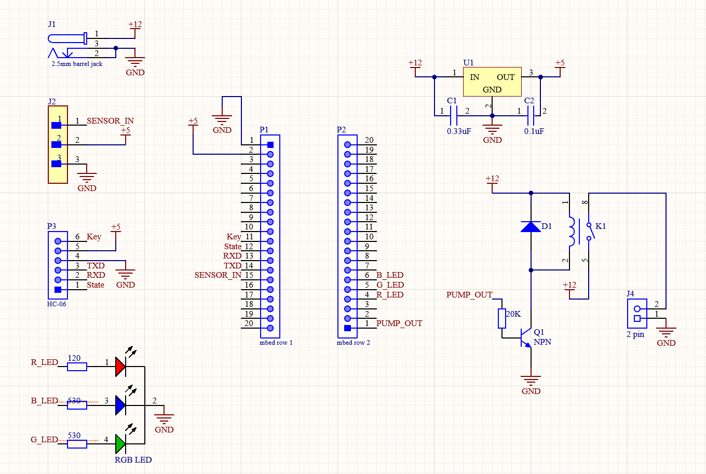
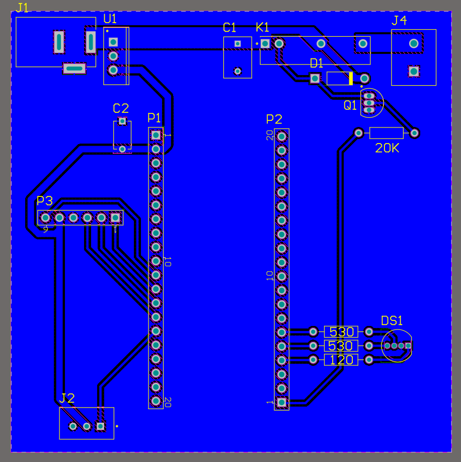

# PlantFeeder
This is **Achintya Mohan** and **Dylan Mira's** project for **ECE 4180**. We decided to make a water feeder for my plant that
was dying because of all the times I forgot to water it.

## Bill of Materials
1. [mBed](https://www.sparkfun.com/products/9564)
2. [Capacitive Soil Moisture Sensor](https://www.amazon.com/Gikfun-Capacitive-Corrosion-Resistant-Detection/dp/B07H3P1NRM/ref=asc_df_B07H3P1NRM/?tag=hyprod-20&linkCode=df0&hvadid=278878233965&hvpos=&hvnetw=g&hvrand=8564046167453132646&hvpone=&hvptwo=&hvqmt=&hvdev=c&hvdvcmdl=&hvlocint=&hvlocphy=1015254&hvtargid=pla-524998080120&psc=1)
3. [12V 240L/H, 3.6W Submersible Water Pump] (https://www.amazon.com/LEDGLE-Submersible-Ultra-Quiet-Dual-Purpose-Hydroponics/dp/B085NQ5VVJ/ref=asc_df_B085NQ5VVJ/?tag=&linkCode=df0&hvadid=416723245886&hvpos=&hvnetw=g&hvrand=9662284882248460044&hvpone=&hvptwo=&hvqmt=&hvdev=c&hvdvcmdl=&hvlocint=&hvlocphy=1015254&hvtargid=pla-896669534049&ref=&adgrpid=96812686551&th=1)
4. [RGB LED](https://www.sparkfun.com/products/105)
5. [5V Relay](https://omronfs.omron.com/en_US/ecb/products/pdf/en-g6dn.pdf)
6. [NPN Transistor](https://www.farnell.com/datasheets/1789499.pdf)
7. [5V Linear Regulator](https://www.mouser.com/datasheet/2/389/cd00000444-1795274.pdf)
8. [Diode](https://www.onsemi.com/pdf/datasheet/1n4001-d.pdf)
9. .1uF and a .33 uF Capacitor
10. 20 kΩ, 530Ω, and a 120Ω resistors

## Schematic

## Source Code Usage
- Code is written for **Mbed OS 2** in the online Mbed IDE
- Requires `mbed.h` and `rtos.h`
- RGB LED light color meaning -
|**LED State**|**Meaning**|
|Blinking blue|Soil is dry, the pump runs for 2 seconds and waits till the next sample|
|Blinking white|Soil is moist, waits for 100 seconds|
|Solid red|Waiting for 30 minutes to sample again|
- Code utilizes built-in pin definitions for the on-board LEDs, these will need to be changed for other microcontrollers
- Soil mositure value for detrmining soil dryness is hardcoded to 2.2V on the ADC input (this can change depending on soil/plant conditions)

## Media

